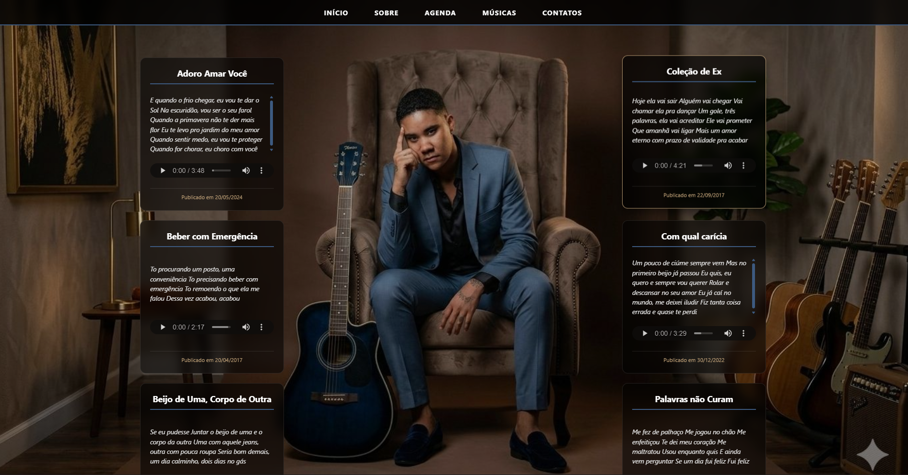
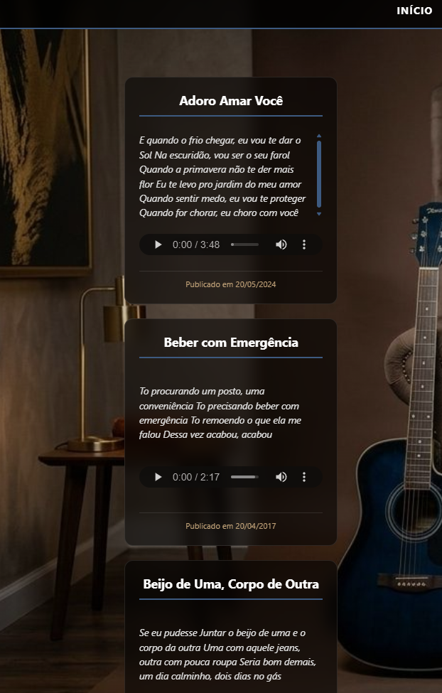

# 🎵 Landing Page - Jefferson Moraes


Uma landing page desenvolvida para o cantor Jefferson Moraes, simulando sua página oficial com cards musicais. Projeto acadêmico para a disciplina de Desenvolvimento Web.

## Screenshots

### Página Principal


### Cards Musicais



## Sobre o Projeto

Este site foi criado como atividade prática da faculdade, com o objetivo de desenvolver uma landing page funcional aplicando conceitos de HTML semântico e CSS. A página apresenta as principais músicas do artista em formato de cards, cada um contendo:

- **Título da música**: Nome da canção em destaque
- **Trecho do refrão**: Parte da letra para identificação
- **Player de áudio**: Player funcional para ouvir a música
- **Data de publicação**: Rodapé com informação da postagem

## Tecnologias Utilizadas

- **HTML5** - Estruturação semântica do conteúdo
- **CSS3** - Estilização e responsividade
  - Flexbox para organização dos cards
  - Efeito vidro (glass effect)
  - Media queries para responsividade

## Funcionalidades

- Menu de navegação fixo no topo
- 10 cards musicais com players de áudio
- Imagem de fundo personalizada (foto própria)
- Efeito hover nos cards
- Design responsivo (5 cards por linha no desktop, 1 no celular)

## Músicas Incluídas

1. Adoro Amar Você
2. Beber com Emergência
3. Beijo de Uma, Corpo de Outra
4. Bipolar
5. Caixa de Surpresa
6. Coleção de Ex
7. Com qual carícia
8. Palavras não Curam
9. Um Centímetro
10. Um Pouco Mais

## Design

O projeto utiliza uma paleta de cores escura com tons de azul:

- Fundo: Imagem pessoal com sobreposição escura
- Cards: Efeito vidro com transparência
- Destaques: Azul (#0066ff) para bordas e hover
- Texto: Branco com sombra para legibilidade

## Como Executar

1. Clone o repositório:
   ```bash
   git clone [https://github.com/FaculdadeJV/Landing_Page.git]
   ```

2. Abra o arquivo `index.html` no navegador

## Autor
- [Jonathan A. Lêla]
- RA: [22408629]
- [Engenharia da Computação] - [CEUB]

---

**Atividade acadêmica - Sem fins comerciais**
